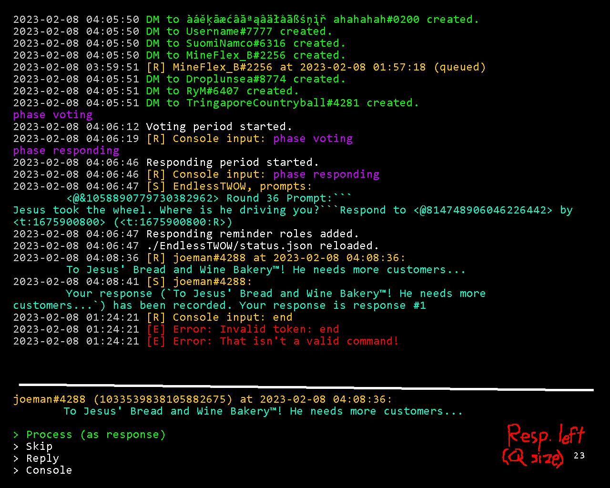

# Responding
## Dummies
- How to designate dummies?

(EndlessTWOW)
- Should they be rank numbered or not?
- Should they be designated or drps?

## Editing behavior
| | Doesn't submit number | Submits number |
| --- | --- | --- |
| Submits 1 response, ineligible for multiple | :) | Treat number as part of response? Remove number? |
| Submits 1 response, eligible for multiple | ??? | ??? |
| Submits multiple responses | Error | :) |

## First response message
(EndlessTWOW) As this is your first response, you have automatically been added three ping roles. You may remove them at <#813619463446331443>.

## Recording message
Your response, `apsdijf` has been recorded.
It is your **2nd** and this round's **13th** submitted response.
You may send **0** more responses.
Send `wb edit 2 [edited response]` to edit this response.

# Stats
- Store stats someplace?
- Specify whether stats apply to rounds, seasons, or twows and for individuals or everyone
- Have a keyword to get the length of a list, `length` or `size` or `count`
- Pipe stats into other stats? What would that even mean? It'd probably use `|`
	- Maybe pipe them into some processing functions, like that length thing
- Squash stat dimensions? like `[3]` vs `3`

## Stat ranges
- What rounds or seasons or twows to run the stat over
- Seasons would break into all rounds for round-specific stats for example
	- Treat round names in season ranges like all other invalid input
- ~~For stats with both range and contestants, the round range would be first~~ No need for contestant ranges
- If no contestant is specified, it would default to the user
	- Maybe a keyword to specify all contestants?
		- For what purpose? Add if there is a use case
	- Maybe no need to specify non-user contestants at all?

Example: `wb stat listContestants "Round 156"-"Round 160"`

# TUI
