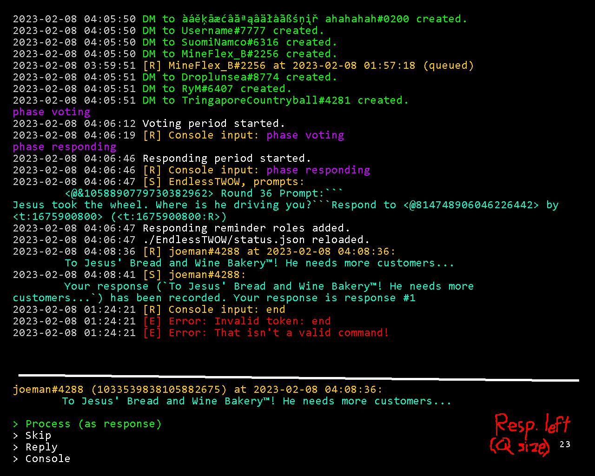

# Editing behavior
## Ineligible for multiple
| | Doesn't submit number | Submits number |
| --- | --- | --- |
| Submits one response | :) | Treat number as part of response? Remove number? |

## Eligible for multiple
| | Doesn't submit number | Submits number |
| --- | --- | --- |
| Submits one response | ??? | ??? |
| Submits multiple responses | Error | :) |

# Recording message
Your response, `apsdijf` has been recorded.
It is your **2nd** and this round's **13th** submitted response.
You may send **0** more responses.
Send `wb edit 2 [edited response]` to edit this response.

# First response message
(EndlessTWOW) As this is your first response, you have automatically been added three ping roles. You may remove them at <#813619463446331443>.

# TUI

# Stats
Store stats someplace?
Stat permission system would be like commands kinda
Specify whether stats apply to rounds, seasons, or twows and for individuals or everyone
There could be like a complex system for specifying what stat over what rounds or seasons or whatnot to show